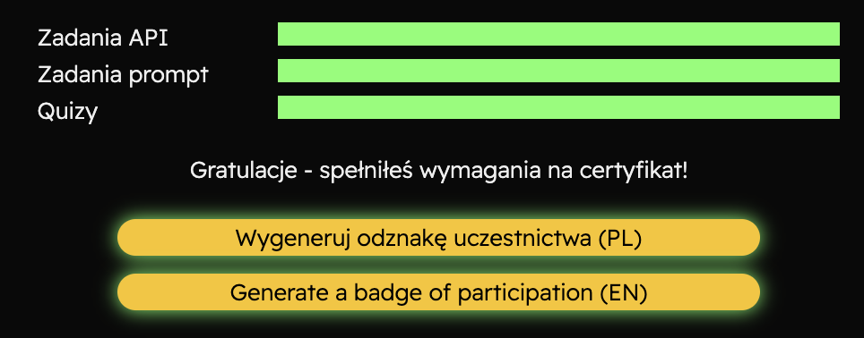

# aidevs2
My solutions for course https://www.aidevs.pl/ 


## Homeworks
We have 2 kind of homeworks
- aidevs_platforms - this are homeworks on AI dev platform. Solutions are just screens :)
- python - here is my python code of solutions

## How to run python code solutions

### Idea of python homeworks
Each task has the following scheme:
1. fetch `token` from aidevs' server (my function `get_auth_token`)
2. fetch task's input data (my function `get_task`)
3. process the data with gpt or algorithms
4. post the result to the answer endpoint (my function `send_answer`)


### Api Keys

You need to first to export two keys

```shell
export AIDEVS_API_KEY=<YOUR_AI_DEV_KEY>
export OPENAI_API_KEY=<YOUR_OPENAPI_KEY>
```

App keys can be retrieved from:
- `AIDEVS_API_KEY` - [https://zadania.aidevs.pl/](https://zadania.aidevs.pl/)
- `OPENAI_API_KEY` - [https://platform.openai.com/account/api-keys](https://platform.openai.com/account/api-keys)

### My Own API
In week 4 & 5 there was a need to create own API to anwer questions.

My API is added in folder `homeworks/my_api`.
I was adding to this same API new endpoints for next lessons.

I used `fastapi`, created `docker` and served it on Azure Cloud as webapp.

### My results
I have done all tasks!




### Certificate

